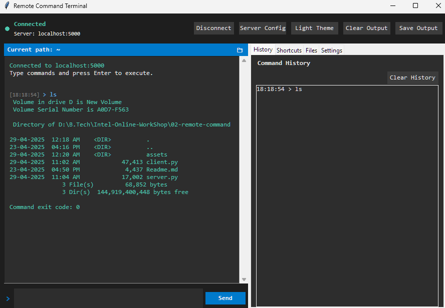
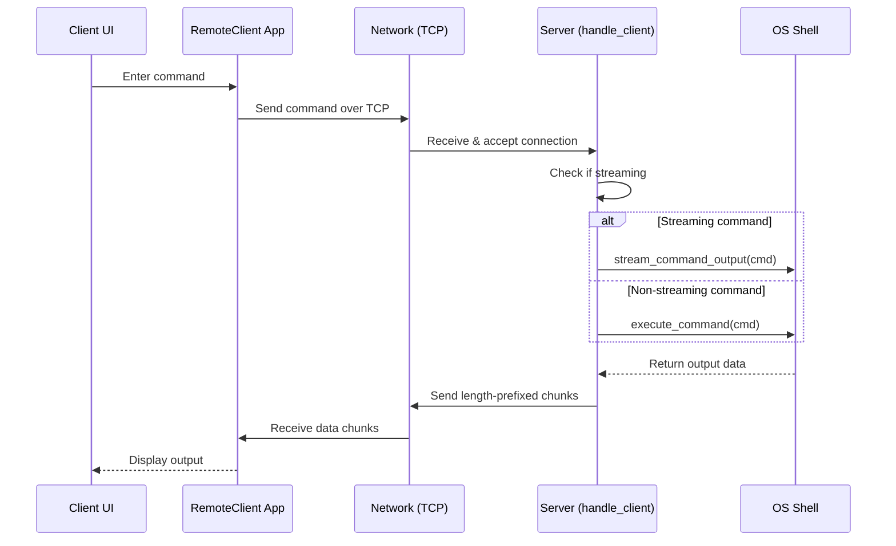

# Remote Command Terminal

A client-server application that allows executing commands on a remote system through a modern, feature-rich GUI interface. This project provides terminal-like functionality over a network connection, implemented purely in Python with Tkinter and standard socket libraries.



## Features

- **Modern Dark-Themed GUI**: Clean, professional UI with VS Code-inspired dark theme and light mode toggle
- **Reliable Command Execution**: Run any terminal command remotely with proper output handling
- **Real-time Command Streaming**: Live output for long-running commands like 'ping'
- **Command History**: Track, save, and reuse previously executed commands
- **Common Command Shortcuts**: Quick access to frequently used system commands
- **Path Tracking**: Keeps track of current working directory across sessions
- **Tab Completion**: Basic command completion for faster typing
- **Save & Clear Output**: Save terminal output to a file or clear the display
- **Real-time Status Indicators**: Visual feedback of connection status and command execution
- **Cross-Platform**: Works on Windows, macOS, and Linux

## Requirements

- Python 3.6 or higher
- Tkinter (usually included with Python)

## Installation

No special installation required. Simply clone or download the repository:

```bash
git clone https://github.com/0xarchit/remote-command-terminal.git
cd remote-command-terminal
```

## Usage

### Starting the Server

Run the server on the machine you want to control:

```bash
python server.py
```

By default, the server listens on `localhost:5000`. To allow remote connections, modify the HOST variable in `server.py`.

### Launching the Client

On your local machine, start the client application:

```bash
python client.py
```

The client will automatically attempt to connect to the server.

### Running Commands

1. **Basic Usage**:
   - Type a command in the input field and press Enter or click "Send"
   - View the output in the main display area

2. **Navigation and History**:
   - Use the Up/Down arrow keys to navigate through command history
   - Double-click items in the history panel to reuse them
   - Use the shortcut buttons in the "Shortcuts" tab for common system commands

3. **Special Features**:
   - Save output to file using the "Save Output" button
   - Clear the display with "Clear Output" button
   - Path tracking shows your current directory

## Command Execution

The system supports all standard terminal commands, including:

- Directory navigation (cd, dir, ls)
- File operations (copy, move, delete)
- System information commands (systeminfo, ipconfig/ifconfig)
- Process management (tasklist, ps)
- Network tools (ping, tracert)

## Technical Details

### Communication Protocol

The client and server communicate using a simple length-prefixed protocol:

1. Client sends commands terminated by newline
2. Server executes the command and captures output
3. For regular commands:
   - Server sends a 4-byte length prefix followed by the output data
4. For streaming commands (like ping):
   - Server sends stream start marker
   - Multiple chunks of data are sent as they become available
   - Stream end marker is sent when command completes

### Security Considerations

This application is designed for educational purposes and local network use. For production environments, consider implementing:

- Encrypted communication (SSL/TLS)
- User authentication
- IP filtering
- Command whitelisting

### Data Flow Diagram



## Troubleshooting

- **Connection Refused**: Ensure the server is running before launching the client
- **Command Not Working**: Some interactive commands may not work as expected in remote execution
- **Frozen Client**: Long-running commands have a timeout to prevent hanging
- **Path Tracking Issues**: The path tracking is client-side and may become out of sync with the server's actual path

## Future Enhancements

- File transfer capabilities
- Server environment variables display
- Multiple saved connection profiles
- Secure connection with authentication
- Better tab completion with server-side suggestions
- Server discovery on local network

## License

[MIT License](LICENSE)

## Contributing

Contributions are welcome! Please feel free to submit a Pull Request.